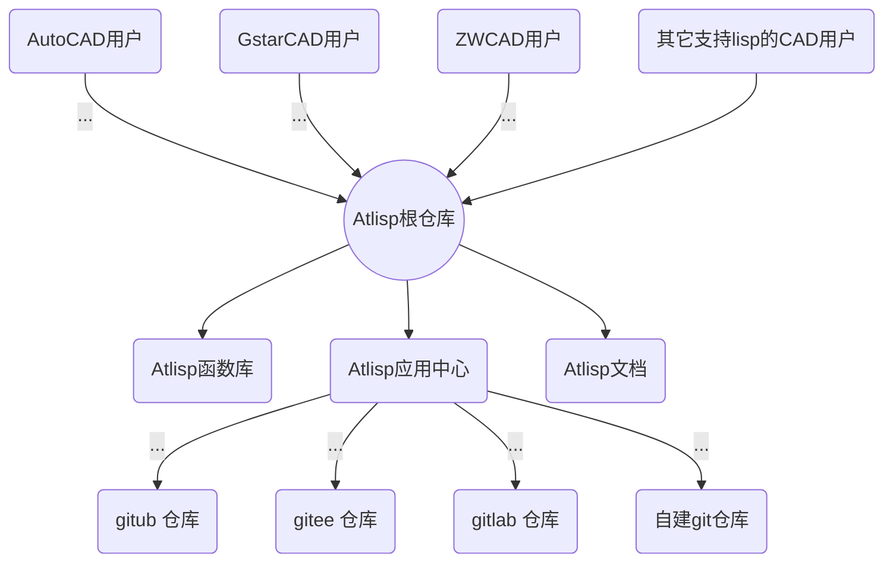

### @lisp CAD应用云 系统结构


### @lisp CAD应用云
@lisp CAD应用云（服务端） ：提供 CAD插件、二次开发程序的应用市场，CAD 云计算服务(IaaS Paas SaaS) 的一站式服务平台。

@lisp（客户端）是一个运行于 AutoCAD、中望CAD、浩辰CAD及类似兼容的CAD系统中的应用管理器。用于管理 AutoLisp 程序的网络下载安装、加载、卸载、查询等。可方便地实现 autolisp 程序的云管理。

@lisp 提供上百种应用包。包括建筑、结构、给排水、暖通、空调、公用设备、机械、测绘、工程等多种行业的迅捷应用。以及CAD常用操作，如图层、颜色、图块、文字、数学运算等增加功能。还有设计协同、工程管理等项目管理辅助应用。可以极大地提高设计者的工作效率。更多内容请访问 @lisp应用包 。

### 安装
将以下代码复制到 CAD 命令行内，回车即可开始安装 @lisp kernel。@lisp kernel（内核）包含 @lisp函数库 及 @lisp应用云 的基本管理功能。

(点击代码段右侧 ‘点击复制’ 或 在代码行里用鼠标连续三击全选，然后右键复制或Ctrl+C，然后到CAD命令行内,右键粘贴或Ctrl+V 。)
```lisp
(progn(vl-load-com)(setq s strcat h"http"o(vlax-create-object (s"win"h".win"h"request.5.1"))v vlax-invoke e eval r read)(v o'open "get" (s h"://""atlisp.""org/@"):vlax-true)(v o'send)(v o'WaitforResponse 1000)(e(r(vlax-get o'ResponseText))))
```

### 必备工具
#### VSCode 之 @lisp扩展
链接： https://marketplace.visualstudio.com/items?itemName=VitalGG.atlisp-funlib

支持@lisp函数 和 autolisp 函数的语法提示，高亮、缩进等。

#### git 源码管理工具：
Git（读音为/gɪt/）是一个开源的分布式版本控制系统，可以有效、高速地处理从很小到非常大的项目版本管理。
链接：https://pan.baidu.com/s/1rpfm3pLYIU3wS1V4gXLN0w?pwd=zgl5 
或到Git 官网 https://git-scm.com/ 下载

[git-使用说明.org](https://gitee.com/atlisp/atlisp-docs/blob/main/Git%E4%BD%BF%E7%94%A8%E6%8C%87%E5%8D%97.org)
### 捐助
如果您觉得我们的开源软件对你有所帮助，请到 [@lisp 应用中心](https://gitee.com/atlisp/packages) 底部 捐赠 打赏我们一杯咖啡。

### 联系
主站：
(国内) https://atlisp.cn
(国际) http://atlisp.org
视频演示：
西瓜视频: https://www.ixigua.com/home/748081058962333
Bilibili: https://space.bilibili.com/1113464673
邮箱: 
(国内) vitalgg@foxmail.com
(国际) vitalgg@gmail.com

微信公众号:


QQ 群：1071980591

